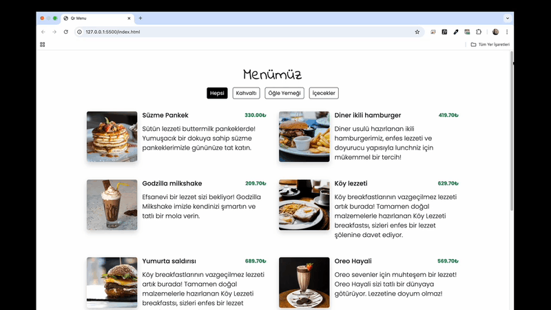

# Qr-Menu 🍽️

<li>Bu proje HTML5,CSS,JS,API ile oluşturulmuş Menü listesi arayüzü içerir.</li>
<li>Menü listesine kategoriler sekmesi ile erişip içeriğini ise detay sayfasında bulabilirsiniz.</li>
<li>Kullanıcı dostu arayüzü,duyarlı tasarımı ile kolay erişim olanağı sunar.</li>

# Kullanılan Teknolojiler 🎨

<li>HTML5</li>
<li>CSS</li>
<li>JS</li>
<li>API</li>
<li>RESPONSİVE</li>

# Ekran Görüntüsü 🎥
      

# İletişim 📩
yunusemreoral@hotmail.com.tr

